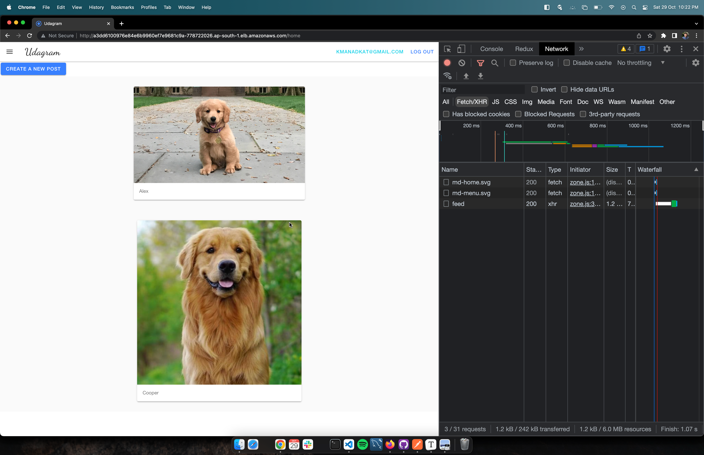
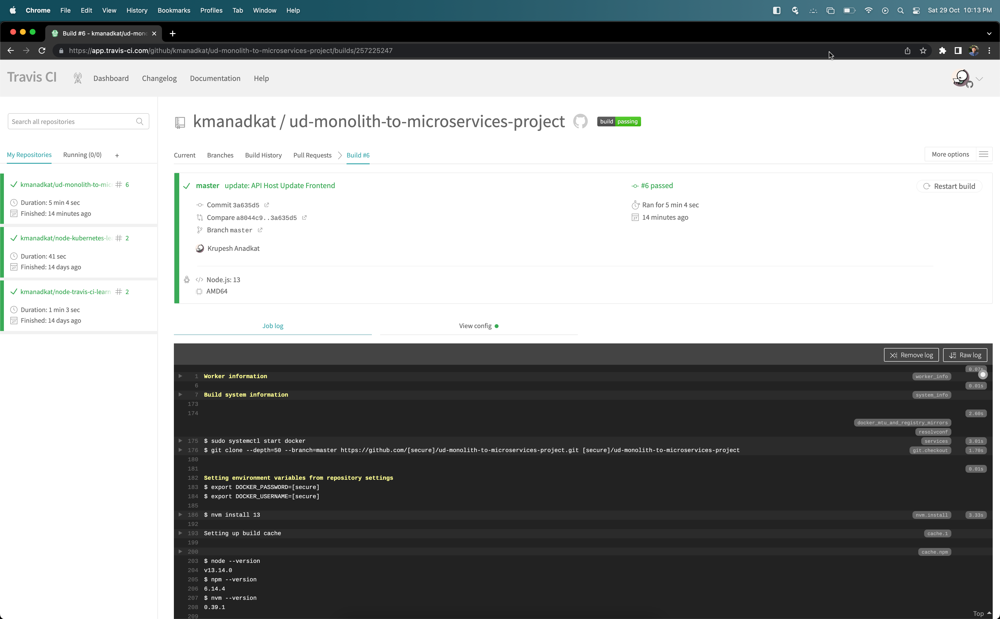
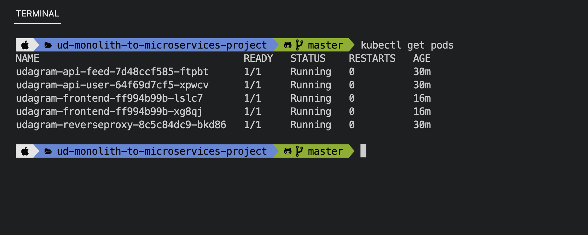
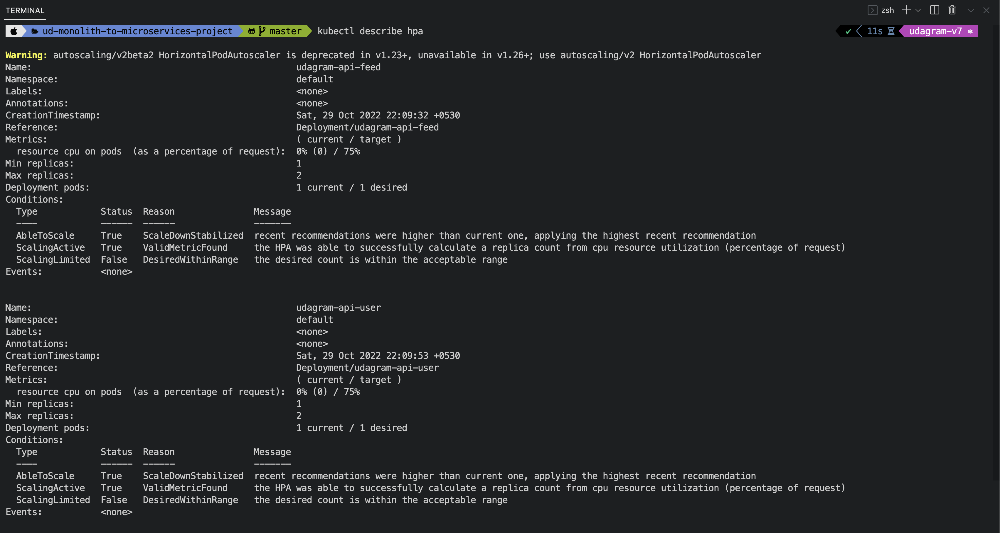

# Udagram Microservices

Udagram is a simple cloud application developed alongside the Udacity Cloud Developer Nanodegree. It allows users to register and log into a web client and post photos to the feed

The project is composed of following microservices:
1. M1 Frontend - Angular web application built with Ionic Framework
2. M2 Backend `/feed` - Node & Express js
3. M3 Backend `/user` - Node & Express js
4. M4 NGINX Reverse Proxy

*All credentials or secrets show below are revoked for security reasons. They are shown only for learning purposes.*


<p align="center"><i>Image Credits - Udacity Mentor Juan D</i></p>


### Kubernetes Cluster


<p align="center"><i>Image Credits - Udacity</i></p>

### Continuous Integration

On commit push to `main` Continuous Integration pipeline (travis ci) is triggered following steps in `.travis.yml` . It builds new docker images for all microservices listed above and pushes to [Docker Hub](https://hub.docker.com/u/kmanadkat) 

1.  [udagram-frontend](https://hub.docker.com/r/kmanadkat/udagram-frontend)
2. [udagram-api-feed](https://hub.docker.com/r/kmanadkat/udagram-api-feed)
3. [udagram-api-user](https://hub.docker.com/r/kmanadkat/udagram-api-user)
4. [udagram-api-proxy](https://hub.docker.com/r/kmanadkat/udagram-reverseproxy)

### AWS Services Used

Following AWS services are used to deploy and host Udagram:

1. Amazon Relational Database Service - PostgreSQL based for storing users feed & auth information
2. Amazon Simple Storage Service - for storing static image files upload by user in the form of posts
3. Amazon Elastic Kubernetes Service - for docker containers orchestration

### 1. Setting Up AWS S3 Bucket

1. Bucket Name: udagram-<account-id>-dev

2. ACLs Disabled

3. Uncheck Block all public access

4. Bucket Version - disabled

5. Add Tag: project - mono-to-micro

6. Server-side encryption - disabled

7. Object lock - disabled

8. Add bucket policy to grant full access of bucket to other aws services
   ```json
   {
       "Version": "2012-10-17",
       "Id": "Policy1666448178136",
       "Statement": [
           {
               "Sid": "Stmt1666447767633",
               "Effect": "Allow",
               "Principal": "*",
               "Action": "s3:*",
               "Resource": "arn:aws:s3:::udagram-<account-id>-dev"
           }
       ]
   }
   ```

9. Add CORs policy to allow request from any origin
   ```json
   [
       {
           "AllowedHeaders": [
               "*"
           ],
           "AllowedMethods": [
               "POST",
               "GET",
               "PUT",
               "DELETE",
               "HEAD"
           ],
           "AllowedOrigins": [
               "*"
           ],
           "ExposeHeaders": []
       }
   ]    
   ```

### 2. Setting Up AWS RDS PosgreSQL

Creating Postgres RDS Instance

1. Standard Create
2. Engine PostgreSQL
3. Template - Free tier
4. Database Identifier - udagram-rds-dev
5. Master Username - postgres
6. Master Password - <password>
7. Allocated Storage - 20GB
8. Uncheck Enabled storage autoscaling
9. Don't Connect to EC2 computer resource
10. Default VPC
11. Public Access - Yes
12. Default Security Group
13. DB Authentication - password
14. Turn on Performance Monitoring (free tier - 7 days)
15. Uncheck Enhanced Monitoring
16. Initial Database Name - postgres
17. Uncheck - Backup, Encryption, Maintenance

### 3. Setting Up AWS EKS Cluster

This step is bit involved because it needs various yaml files created first and then make use of them to setup containers in kubernetes cluster.

**a. `/deployment/environment-variables/aws-secret.yaml`** 

```yaml
apiVersion: v1
kind: Secret
type: Opaque
data:
  credentials: <Base 64 encoding of AWS Credentials files>
metadata:
  name: aws-secret
```

> Getting base64 encoding value in macOS: `cat ~/.aws/credentials | head -n 3 | base64`
> You need to have the profile set before running above command, check [aws configure](https://docs.aws.amazon.com/cli/latest/userguide/cli-configure-quickstart.html)

**b. `/deployment/environment-variables/env-configmap.yaml`** 

```yaml
apiVersion: v1
kind: ConfigMap
data:
  AWS_BUCKET: udagram-<account-id>-dev
  AWS_PROFILE: default
  AWS_REGION: ap-south-1
  JWT_SECRET: <some-secret>
  POSTGRES_DB: postgres
  POSTGRES_HOST: <hostname found at RDS>Database>Connectivity & security>
  URL: http://localhost:8100
metadata:
  name: env-config
```

**b. `/deployment/environment-variables/env-secret.yaml`** 

```yaml
apiVersion: v1
kind: Secret
type: Opaque
data:
  POSTGRES_USERNAME: <base64 encoded rds db username>
  POSTGRES_PASSWORD: <base64 encoded rds db master password>
metadata:
  name: env-secret
```

Under `/deployment` folder create folders for each micro service & create `deployment.yaml` & `service.yaml` files inside it. These are the files that will container information on how to create & orchestrate docker containers inside kubernetes cluster.

| Microservice             | Deployment File                                              | Service File                                           |
| ------------------------ | ------------------------------------------------------------ | ------------------------------------------------------ |
| udagram-api-feed         | [deployment.yaml](./deployment/feed/deployment.yaml)         | [service.yaml](./deployment/feed/service.yaml)         |
| udagram-api-user         | [deployment.yaml](./deployment/user/deployment.yaml)         | [service.yaml](./deployment/user/service.yaml)         |
| udagram-frontend         | [deployment.yaml](./deployment/frontend/deployment.yaml)     | [service.yaml](./deployment/frontend/service.yaml)     |
| udagram-api-reverseproxy | [deployment.yaml](./deployment/reverseproxy/deployment.yaml) | [service.yaml](./deployment/reverseproxy/service.yaml) |

#### Create EKS Cluster

1. Name: udagram-cluster-v3
2. Cluster service role - [create EKS cluster role](https://docs.aws.amazon.com/eks/latest/userguide/service_IAM_role.html#create-service-role)
3. Default VPC, Default Subnets, Default Security Group
4. Cluster endpoint access - Public
5. Networking Add-ons - defaults
6. Configure logging - defaults (all off)
7. Create

#### Create Cluster Node Group

1. Cluster > Compute > Add Node Group
2. Name: udagram-node-group-prod
3. Create Node IAM Role: IAM > Roles > Create role > AWS Service > EC2
   Add permissions: **AmazonEKSWorkerNodePolicy**, **AmazonEC2ContainerRegistryReadOnly**, **AmazonEKS_CNI_Policy**
   Next > Role Name: **AmazonEKSNodeRole** > Create Role
4. Instance Type > **m5.large** > Disk Size: 20 GiB
5. Min size: 2, max size: 3
6. Node group update config: defaults
7. Default Subnets, enable Configure SSH > select key pair (or create new)
8. Select default security group
9. Create

### Configure `kubectl`

1. Test aws user `aws sts get-caller-identity`

2. update kubectl config
   ```shell
   aws eks update-kubeconfig --region ap-south-1 --name udagram-cluster-v4
   ```

3. Test `kubectl get svc`
   ```shell
   NAME         TYPE        CLUSTER-IP   EXTERNAL-IP   PORT(S)   AGE
   kubernetes   ClusterIP   10.100.0.1   <none>        443/TCP   20m
   ```

#### Install Kubernetes Metrics Server

```shell
# Install
kubectl apply -f https://github.com/kubernetes-sigs/metrics-server/releases/latest/download/components.yaml

# Test
kubectl get deployment metrics-server -n kube-system
```


#### Deploy container to cluster

Link all `environment-variable` yaml files and `deployment.yaml` , `service.yaml` files with following:

```shell
kubectl apply -f deployment/environment-variables/aws-secret.yaml
kubectl apply -f deployment/environment-variables/env-configmap.yaml
kubectl apply -f deployment/environment-variables/env-secret.yaml

kubectl apply -f deployment/feed/deployment.yaml
kubectl apply -f deployment/feed/service.yaml
...
...
```

#### Expose Frontend & Reverseproxy

```shell
# Check the deployment names and their pod status
kubectl get deployments

# Create a Service object that exposes the frontend deployment
# The command below will ceates an external load balancer and assigns a fixed, external IP to the Service.
kubectl expose deployment udagram-frontend --type=LoadBalancer --name=publicfrontend
kubectl expose deployment udagram-reverseproxy --type=LoadBalancer --name=publicreverseproxy

kubectl get services
```

Copy external IP of `publicreverseproxy` and put it `udagram-frontend/src/environments/environment.ts` & `environment.prod.ts`

Increment container versions in `.travis.yml` and push commit to git triggering travis CI pipeline.

#### Set up a Kubernetes HPA

```
kubectl autoscale deployment udagram-api-feed --cpu-percent=50 --min=1 --max=2
kubectl autoscale deployment udagram-api-user --cpu-percent=50 --min=1 --max=2
kubectl autoscale deployment udagram-frontend --cpu-percent=50 --min=1 --max=2
kubectl autoscale deployment udagram-reverseproxy --cpu-percent=50 --min=1 --max=2
```

### Project Screenshots

#### Application Preview



#### Dockerhub Images


#### Github Travis CI Integration


#### Travis CI Pipeline - Building Images



#### Kubernetes Cluster


#### Kubernetes Cluster Pods



#### Kubernetes Cluster Services


#### Kubernetes Cluster Pods HPA




#### Kubernetes Cluster Pods Logs


